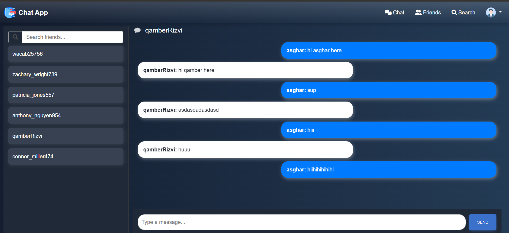
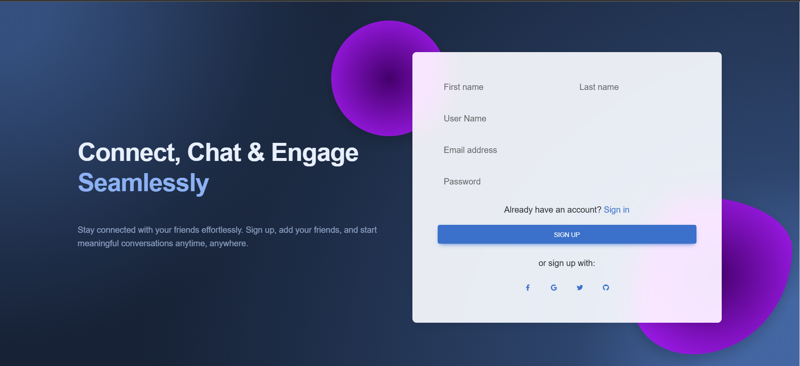
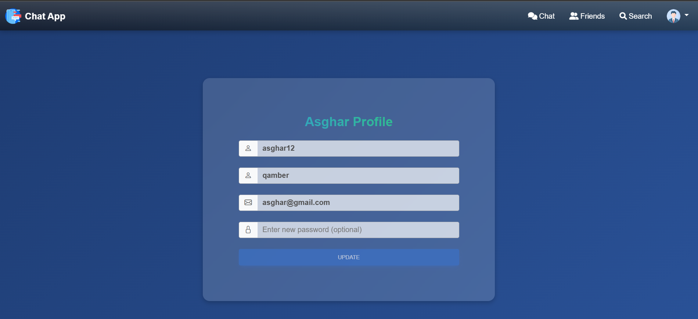
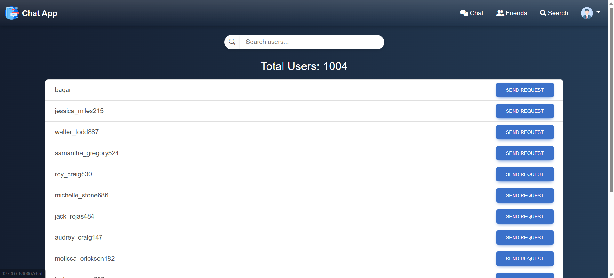
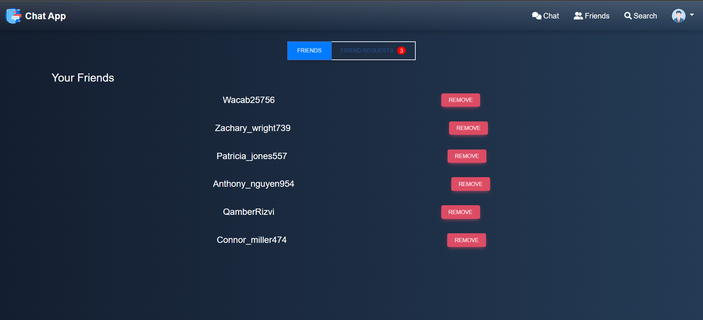

# BuzzChat - A Lively and Energetic Chat



BuzzChat is a **Django-based web application** that provides real-time communication with high-end security, leveraging **WebSockets**, **AJAX (Fetch API)**, and **Django Channels**. It ensures **secure** and **asynchronous** messaging while utilizing **Memurai** (a Redis alternative) for caching and performance optimization.

## 🚀 Features

- **User Authentication** - Sign up, Sign in, and Logout functionality.
- **Real-time Chat** - Dynamic WebSockets communication using Django Channels.
- **Search Users** - Find other users and send them friend requests.
- **Friend Management** - View friends, accept/reject requests.
- **Profile Page** - Manage user profile information.
- **Security Measures** - CSRF & XSS protection, session-based authentication.
- **Efficient Performance** - Optimized with caching via Memurai (Redis alternative).

## 📌 Screenshots

### 🔹 Sign Up Page


### 🔹 Sign In Page


### 🔹 Chat Page


### 🔹 Search Users


### 🔹 Friends List


## 🛠️ Project Structure

```
BuzzChat/
│── chat/
│   ├── templates/  # Contains HTML files
│   ├── static/
│   │   ├── css/    # Contains CSS files
│   │   ├── js/     # Contains JavaScript files
│   ├── management/
│   │   ├── commands/  # Scripts for user generation using Faker
│   ├── signals.py   # Django signals for event handling
│   ├── routing.py   # WebSockets routing
│   ├── consumer.py  # WebSockets consumer logic
│   ├── views.py     # Django views
│   ├── models.py    # Database models
│
│── genericchannels/  # Custom Django channels utilities
│
│── manage.py         # Django project manager
│── db.sqlite3        # Database file
```

## 🔧 Technologies Used

- **Django** - Backend Framework
- **Django Channels** - Real-time WebSockets
- **JavaScript Fetch API** - Asynchronous Data Fetching
- **HTML, CSS, Bootstrap** - Frontend Design
- **Memurai (Redis alternative)** - Caching and Performance Boost

## 🔗 Setup Instructions

1. **Clone the Repository:**
   ```sh
   git clone https://github.com/yourusername/buzzchat.git
   cd buzzchat
   ```

2. **Create a Virtual Environment:**
   ```sh
   python -m venv venv
   source venv/bin/activate  # On Windows: venv\Scripts\activate
   ```

3. **Install Dependencies:**
   ```sh
   pip install -r requirements.txt
   ```

4. **Apply Migrations:**
   ```sh
   python manage.py migrate
   ```

5. **Run the Server:**
   ```sh
   python manage.py runserver
   ```

6. **Access the Application:**
   Open your browser and go to [http://127.0.0.1:8000](http://127.0.0.1:8000)

## 🤝 Contribution

Contributions are welcome! If you find a bug or have a feature request, feel free to open an issue.

## 📜 License

This project is licensed under the MIT License.
